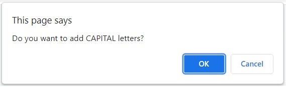

# Password Generator

## Description
This app will generate a random password between 8-128 lower case characters and may include upper case, number and special characters.

## Tech/Framework
* HTML
* CSS
* JavaScript

## Technical Requirements
* Randomly generate passwords between 8 to 128 characters.
* Prompt the user to add Capital letters (upper case), Numbers and/or Special characters on top of Small letters (lower case).
* Passwords should generate at least one character of each of the types of characters selected by the user.

## Screenshots
* Initial Page   

* User Inputs
    - Password Length   
    - Add Upper Case characters   
    - Add Numbers   
    - Special Characters   
* Generated Password   

## Password App Link
[Generate a randomized password](https://jojobautistaum.github.io/passwd-generator/)